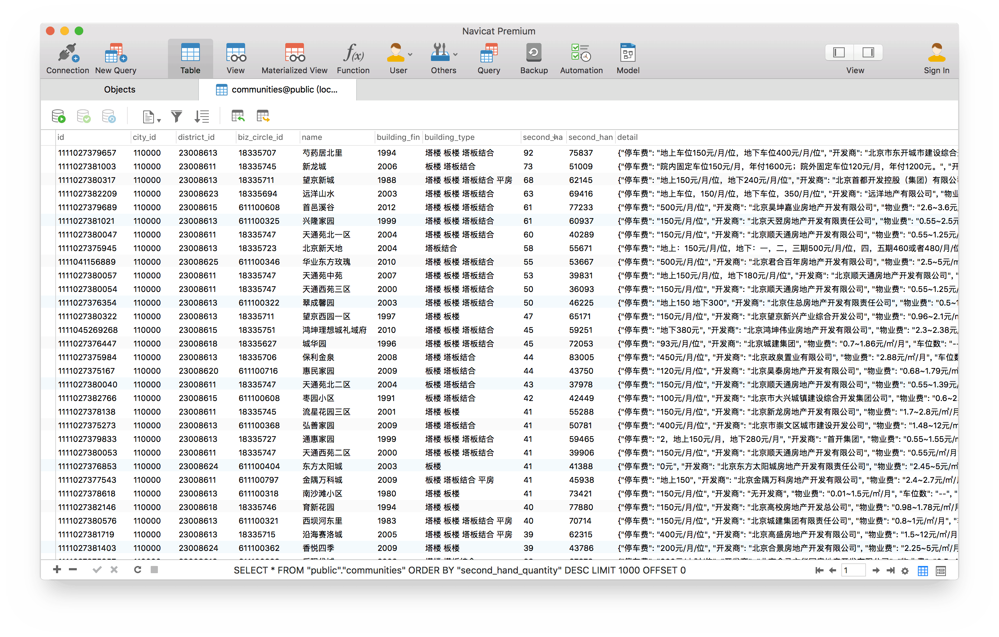

## Super Fast 链家の爬虫

[](https://www.python.org)
[](https://www.postgresql.org)


### 准备工作：

1. 安装`Python`（3.6 或更高版本），安装`PostgreSQL`

2. [建立虚拟运行环境](https://www.baidu.com/s?wd=virtualenv)（可选）

3. 下载代码

4. 安装依赖：`pip install -r requirements.txt`

5. 根据自己的数据库创建配置文件或修改默认配置文件（可选）

6. 创建数据库，如：`createdb -O postgres lian-jia`

7. 准备完成，现在可以愉快的去抓取数据啦~


### 使用方法：

```
app
├── main.py             用于抓取城市、行政区、商圈及小区基本信息。
├── page_crawler.py     用于抓取小区详情页面。
└── page_parser.py      用于解析小区详情信息。
```

```
usage: main.py [-h] [-c CONFIG] [city_id]

positional arguments:
  city_id               city id

optional arguments:
  -h, --help            show this help message and exit
  -c CONFIG, --config CONFIG
                        config file name
```

例如，抓取北京市的数据：

`python app/main.py 110000` （110000 即为北京市的 id）

这步可以获得小区基本信息，由于是通过链家网 API 获得的数据，速度极快。小区详细信息似乎并不能通过 API 获得，只能通过抓取页面的方式获得（链家 App 同样是通过页面来展示小区详情的）。

抓取小区详情页面：`python app/page_crawler.py 110000`

解析小区详情信息：`python app/page_parser.py 110000`

<br>


### 速度：

以北京市为例，链家网中约有 10905 个小区的数据，经测试，3 分钟内可完成小区基本信息的抓取。视网速及服务器响应速度，在使用 10 个线程进行小区详情页面抓取时，用时约 20~30 分钟。


### 配置文件说明：

将默认配置文件复制为`config.json`，然后修改对应项即可。


### 设置网络代理：

设置环境变量 `HTTP_PROXY` / `HTTPS_PROXY` 即可。


### 示例输出:

```log
2017-10-26 16:57:23,083 root[config] INFO: 使用配置文件 "config.json".
2017-10-26 16:57:23,420 root[main] INFO: 初始化/更新城市信息... city_id=110000
2017-10-26 16:57:24,662 root[main] INFO: 城市=北京, 区域=东城, 商圈数=27
2017-10-26 16:57:24,742 root[main] INFO: 城市=北京, 区域=西城, 商圈数=26
2017-10-26 16:57:24,802 root[main] INFO: 城市=北京, 区域=朝阳, 商圈数=63
2017-10-26 16:57:24,942 root[main] INFO: 城市=北京, 区域=海淀, 商圈数=45
...
2017-10-26 16:57:25,021 root[main] INFO: 城市=北京, 区域=丰台, 商圈数=37
2017-10-26 16:57:25,285 root[main] INFO: 城市=北京, 区域=延庆, 商圈数=1
2017-10-26 16:57:25,289 root[main] INFO: 初始化/更新城市信息结束.
2017-10-26 16:57:25,290 root[main] INFO: 更新久于 3 天的小区信息...
2017-10-26 16:57:25,298 root[main] INFO: 需更新总商圈数量: 235
2017-10-26 16:57:25,977 root[main] INFO: 进度=1/235, 商圈=朝阳门内, 小区数=47
2017-10-26 16:57:27,206 root[main] INFO: 进度=2/235, 商圈=灯市口, 小区数=64
2017-10-26 16:57:27,618 root[main] INFO: 进度=3/235, 商圈=东单, 小区数=28
...
2017-10-26 17:00:33,082 root[main] INFO: 进度=233/235, 商圈=怀柔其它, 小区数=2
2017-10-26 17:00:34,500 root[main] INFO: 进度=234/235, 商圈=密云其它, 小区数=89
2017-10-26 17:00:35,217 root[main] INFO: 进度=235/235, 商圈=延庆其它, 小区数=35
2017-10-26 17:00:35,239 root[main] INFO: 小区信息更新完毕.
```


### Screenshot:


